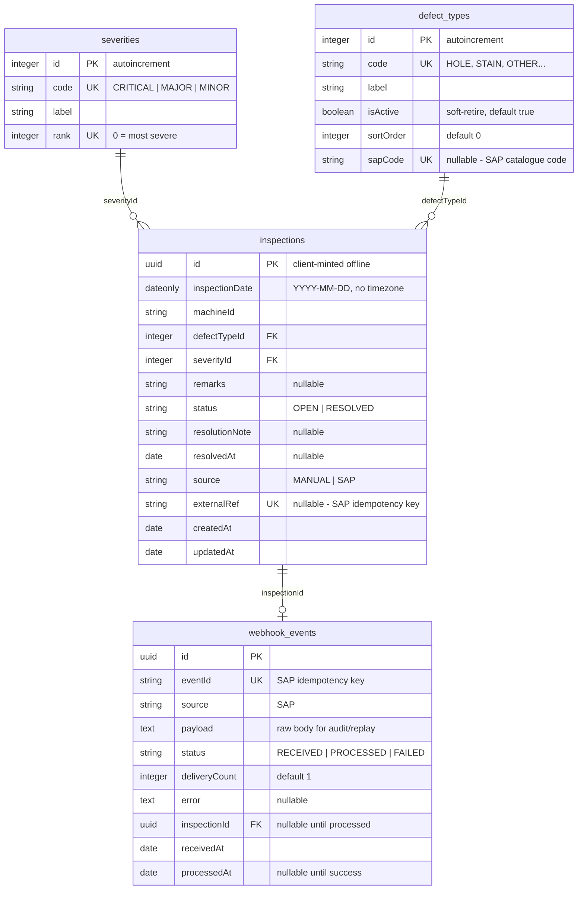
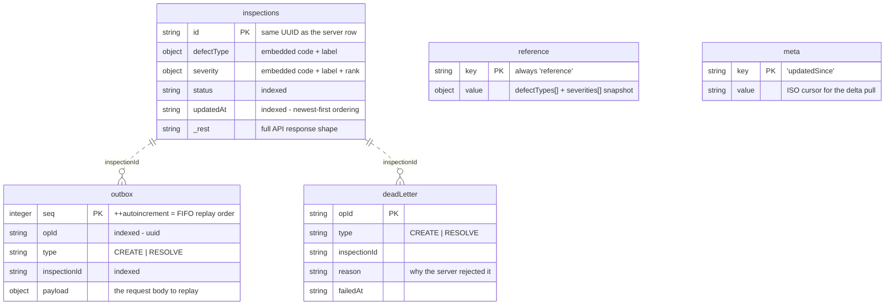
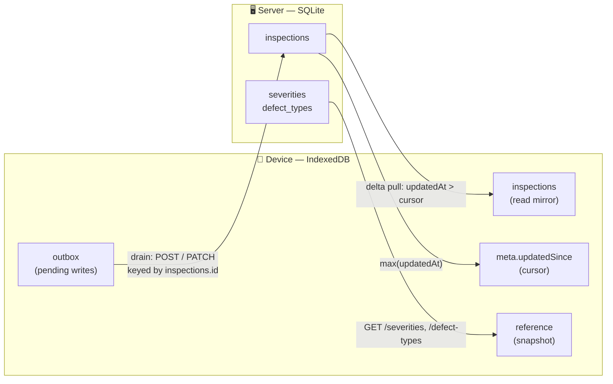

# Quality Inspection Tracker

A mobile-first web app for shop-floor supervisors to log, track, and resolve fabric quality
defects from a phone — replacing the paper register.

React + Vite + TypeScript + Tailwind (Redux Toolkit + Redux Saga) talking to an Express +
TypeScript REST API over Sequelize and SQLite.

- **Full design & architecture:** [DESIGN.md](DESIGN.md)
- **SAP webhook interface contract:** [docs/sap-webhook.md](docs/sap-webhook.md)

---

## Status

Built and tested: reference data, logging an inspection (idempotent), the list with
filtering, sorting, pagination and delta pull, inspection detail, resolve with its invariants,
the summary dashboard, the **signed, idempotent SAP webhook**, and **offline-first sync**
(service worker, IndexedDB outbox, replay engine). **165 tests passing** (115 API, 50 web).

Runs either from source or with a single `docker compose up`.

Deliberately not built: JWT auth, which the brief lists as optional — see
[Deliberately not doing](#deliberately-not-doing) for that and the other conscious omissions.

---

## Running it

Two independent npm projects. No Docker required.

```bash
# 1. API  → http://localhost:4000
cd api
npm install
npm run migrate      # creates data/dev.sqlite from hand-written migrations
npm run seed         # reference data + 8 demo inspections
npm run dev

# 2. Web  → http://localhost:5173
cd web
npm install
npm run dev
```

The web dev server proxies `/api` to `http://localhost:4000`, so both run same-origin and
there's nothing to configure. Check the API is up:

```bash
curl http://localhost:4000/api/health
# {"data":{"status":"ok"}}
```

### With Docker

One command, no Node needed on the host:

```bash
docker compose up --build
```

- Web → <http://localhost:8080>  (`WEB_PORT=8081 docker compose up` if 8080 is taken)
- API → <http://localhost:4000>

The API container runs migrations and seeders on startup — both are tracked, so restarting
never double-applies — and stores its SQLite file in a named volume, so data survives
`docker compose down`. nginx serves the built SPA and proxies `/api` to the API service, so the
app is same-origin in containers exactly as it is behind the Vite dev proxy.

### Tests

```bash
cd api && npm test    # 115 tests — Vitest + supertest against the Express app in-process
cd web && npm test    # 50 tests — Vitest over reducers, sagas and pure helpers
```

`pretest` drops, migrates, and seeds `api/data/test.sqlite` before the API suite runs, so the
tests always start from a known database.

---

## API

Base path `/api`. Every response is either `{ data, meta? }` or
`{ error: { code, message, details? } }` — so the client handles success and failure the same
way everywhere. `error.code` is a closed set: `VALIDATION_ERROR`, `NOT_FOUND`,
`ALREADY_RESOLVED`, `INVALID_SIGNATURE`, `INTERNAL_ERROR`.

| Method | Path | Purpose | Success | Errors |
|---|---|---|---|---|
| GET | `/api/health` | Liveness | 200 | — |
| GET | `/api/severities` | Dropdown options | 200 | — |
| GET | `/api/defect-types` | Dropdown options (active only) | 200 | — |
| POST | `/api/inspections` | Create — **idempotent on the client `id`** | 201 new / 200 existing | 400 |
| GET | `/api/inspections` | List: filter, sort, paginate, delta pull | 200 + `meta` | 400 |
| GET | `/api/inspections/summary` | Counts by status × severity | 200 | — |
| GET | `/api/inspections/:id` | One inspection | 200 | 400, 404 |
| PATCH | `/api/inspections/:id/resolve` | Resolve with a mandatory note | 200 | 400, 404, 409 |
| POST | `/api/sap-webhook` | Signed, idempotent SAP ingest — [contract](docs/sap-webhook.md) | 201 new / 200 duplicate | 400, 401, 500 |

**List query parameters**

| Param | Values |
|---|---|
| `page`, `pageSize` | `pageSize` capped at 100, default 20 |
| `status` | `OPEN` · `RESOLVED` |
| `severityCode`, `defectTypeCode` | any code from the reference endpoints |
| `dateFrom`, `dateTo` | `YYYY-MM-DD`, inclusive at both ends |
| `sortBy` | `createdAt` (default) · `inspectionDate` · `severity` |
| `sortDir` | `asc` · `desc` — on `severity` this applies to rank, so `asc` is most-severe-first |
| `updatedSince` | ISO timestamp; **sync mode** — returns rows with `updatedAt >` the cursor, ordered ascending. Can't be combined with `sortBy`. |

```bash
# Open critical defects in the first week of July, most severe first
curl "http://localhost:4000/api/inspections?status=OPEN&dateFrom=2026-07-01&dateTo=2026-07-07&sortBy=severity&sortDir=asc"

# Resolve one
curl -X PATCH http://localhost:4000/api/inspections/<id>/resolve \
  -H 'Content-Type: application/json' \
  -d '{"resolutionNote":"Re-wove the section and re-inspected"}'
```

---

## Data model

There are two databases: SQLite on the server, IndexedDB on the device. They are **not** the same
schema, and the difference is deliberate — the server stores normalised rows, the device stores
the API's response shape.

### Server — SQLite

Four tables. Two lookups (`severities`, `defect_types`) that `inspections` points at, plus
`webhook_events` — the inbound SAP log that points back at whatever inspection it produced.



A few things the shapes are saying:

- **`inspections.id` is a UUID, not an autoincrement**, because the phone mints it before the row
  exists on the server. That's what makes a replayed create idempotent — see
  [One idempotency principle](#architecture-decisions) below.
- **`webhook_events` is zero-or-one per inspection.** Nothing structural enforces that; the unique
  `eventId` and unique `externalRef` do, together.
- **`inspectionId` and `processedAt` are nullable on purpose.** Both stay null until processing
  succeeds, so `processedAt IS NULL` is an exact query for "received but never handled" — the
  dead-letter state is representable rather than an error case.
- **Indexes on `inspections`:** every column the list can filter or sort by
  (`status`, `severityId`, `defectTypeId`, `inspectionDate`, `createdAt`), plus `updatedAt` for the
  offline delta pull and a unique index on `externalRef`.

`status` deliberately isn't a fifth table — the rule is classification → lookup table, workflow
state → plain string.

### Device — IndexedDB (Dexie)

Five object stores, declared in one place ([`web/src/offline/db.ts`](web/src/offline/db.ts)). Three
jobs: **read** offline (`inspections`, `reference`), **write** offline (`outbox`, `deadLetter`),
and **remember where we got to** (`meta`).

Relationships are dashed because IndexedDB has no foreign keys — object stores are independent,
and these links are conventions the sync saga maintains, not constraints the database enforces.



- **`inspections` is denormalised on purpose.** It stores what `GET /api/inspections` returned —
  `defectType` and `severity` embedded as `{ code, label }` — not the server's `defectTypeId` /
  `severityId`. Surrogate ids never leave the backend, so the device has nothing to join on and
  doesn't need one: a cached row renders without a lookup.
- **`outbox.seq` is a Dexie `++autoincrement`, and that is a correctness requirement.** A CREATE
  and the RESOLVE of the same inspection share an `inspectionId`, so the create must replay first.
  FIFO ordering comes free from the key.
- **`deadLetter` is terminal.** Ops the server rejected with a 400 — unfixable by retrying, so
  they leave the queue and become visible instead of blocking it forever.
- **`meta` holds one row today**, the `updatedSince` cursor. A key/value store rather than a
  dedicated table so the next small scalar doesn't need a schema version bump.

### How the two line up



Four correspondences are worth knowing by name:

| Device | Server | What ties them |
|---|---|---|
| `inspections.id` | `inspections.id` | **The same UUID.** Minted on the device before the row exists on the server — this is what makes a replayed create idempotent rather than duplicating. |
| `outbox.inspectionId` | `inspections.id` | The queued op names the row it will create or resolve, so a drain needs no server-assigned id to proceed. |
| `meta.updatedSince` | `inspections.updatedAt` | The delta-pull cursor. The server's `updatedAt` index exists for exactly this query. |
| `reference.value` | `severities`, `defect_types` | A codes-and-labels snapshot — no ids, because the API speaks in codes. |

The mirror is a **cache, not a peer**: the server is the only source of truth, and a conflict is
always resolved server-side (resolve-once is a conditional `UPDATE`, not a client decision). The
device's job is to hold enough state to keep working during an outage and to replay it safely
afterwards.

---

## Architecture decisions

**Sequelize over Prisma.** I wanted to own my migrations directly — hand-written
`queryInterface` up/down I can explain, rather than migrations generated by diffing a schema —
and to keep the machinery light: Sequelize is pure JS plus a driver, where Prisma adds a
generated client and a query-engine binary. The honest trade-off is TypeScript ergonomics: I
write the model typings myself instead of getting a fully-typed generated client.

**Lookup tables, not enums, for defect type and severity.** They're classification data that
carries metadata — a display label, an active flag, a sort order, a severity rank — and defect
types will grow over time, so they're tables, and the dropdowns read from them. That gives one
source of truth instead of an enum duplicated in the frontend. `status` is different: it's
workflow state with no metadata, so it stays a plain string. The rule is classification → table,
workflow → string.

**Surrogate integer PK plus a unique `code`.** The autoincrement id is stable identity; `code`
is the business key. Renaming a label never cascades through foreign keys, and **the API speaks
in codes** — writes resolve the relation by code, reads include it and return `code` + `label`,
so surrogate ids never leave the backend. One serializer is the single place that happens.

**SQLite.** A single file, no container, instant migrations — the app runs seconds after a
clone, which is worth a lot for a take-home. Behind Sequelize, moving to Postgres for real
concurrency is a dialect and driver change, not a rewrite.

**Redux Toolkit + Redux Saga.** RTK removes the store boilerplate; saga keeps every async call
in one predictable place with real concurrency control — `takeLatest` on fetches so a stale
list can never render, `takeLeading` on submits so a double tap can't double-create. Saga
genuinely earns its keep in the offline phase, where the sync engine is a long-lived watcher
doing a single-flight outbox drain with backoff — declarative in saga, awkward with thunks.

**One idempotency principle, applied twice.** SAP ingest and offline replay are both
at-least-once pipelines, so both rest on idempotent writes keyed by a token: the SAP event id
for the webhook, the client-generated UUID for offline. `POST /api/inspections` accepts the
client's `id` and returns **200 with the stored record** if it already exists, so replaying a
queued create can't duplicate. The webhook is keyed on `eventId` in a `webhook_events` log and
persists before it processes, so a failure becomes an inspectable dead letter that a retry
heals rather than a lost message. Both are backed by a unique constraint, so the database is the
final arbiter even if the application logic were wrong.

**Offline-first is one write path, not two.** Every create and resolve goes through an
IndexedDB outbox — online is simply the case where the queue drains immediately. There is no
`navigator.onLine` branch, so a connection dropping between a check and a request can't lose a
write. A saga drains the queue single-flight with exponential backoff: a replayed create returns
200 because the id already exists, a resolve the server already applied returns 409 and is
reconciled, and only a 400 dead-letters — surfaced in a banner, because silently dropping a
rejected change is the worst thing this app could do.

**Webhook trust is signed over `${timestamp}.${rawBody}`.** Signing the body alone would leave
the timestamp header attacker-controlled — capture one valid delivery, rewrite the timestamp, and
the replay window it exists to enforce does nothing. The raw bytes are used because re-serialised
JSON wouldn't byte-match, which is why that route mounts above `express.json()`. Full contract in
[docs/sap-webhook.md](docs/sap-webhook.md).

**Invariants live in the service layer.** Resolve requires a non-empty note (trimmed, so
whitespace doesn't count) and an inspection resolves exactly once. The resolve is a single
conditional `UPDATE ... WHERE id = ? AND status = 'OPEN'` rather than a read followed by a
write, so two supervisors tapping at the same moment can't both succeed — zero rows affected
*is* the 409. The UI enforces the same rules for feedback, never as the guarantee.

**Validation at the edge, integrity at the bottom.** Zod parses every body, query and param
into a 400 that names the offending field; the service checks business rules; foreign keys and
the unique `externalRef` are the database-level backstop.

**Mobile-first, verified at 390px.** Bottom tabs plus a floating log button, a card list, and a
tap-through detail sheet that hosts the resolve modal. Form controls are 16px (below that, iOS
Safari zooms the page on focus) with 44px tap targets, the shell is sized in `dvh` so the tab
bar isn't clipped by the address bar, and the tab bar respects `safe-area-inset-bottom`.

---

## Testing approach

API tests drive the exported Express app in-process with supertest — no port, no server to
tear down. They run against a real migrated and seeded SQLite file rather than mocks, so the
migrations, the model definitions and the queries are all under test. Isolation lives in the
harness, not in the seeders: `pretest` runs the same `db:seed:all` a human would, then each
test file truncates only the mutable tables so the seeded lookup tables survive.

Web tests cover reducers, sagas and pure helpers. A saga is a generator, so a test walks it one
effect at a time and asserts the plain objects it yields — no network and no mocking library.

The tests that matter most are the ones pinning the invariants: idempotent create doesn't
duplicate, resolve requires a note, resolve-once returns 409, summary counts sum to the total,
sorted pagination never drops or repeats a row, and a calendar date never shifts by a timezone.

---

## Deliberately not doing

- **No users, roles or auth in the base app.** Single supervisor persona; JWT is designed as an
  env-toggleable extra so the app still runs in one command.
- **No machine master table.** `machineId` is free text — a real deployment would pull it from
  the plant's equipment master, which isn't mine to model here.
- **No shared types package.** `types.ts` is duplicated between client and server. At two
  packages the coupling cost is lower than the build complexity; the first thing I'd change
  with more time.
- **No `fake-indexeddb`.** The sync engine's ordering, backoff and reconciliation are unit
  tested by stepping the saga generator; the Dexie modules are deliberately branchless CRUD,
  verified manually. If logic ever moves into them, that's the signal to add the dependency.
- **No component tests.** The state machine behind every loading/empty/error state is unit
  tested at the reducer and saga level; the markup consuming it is verified by a manual pass at
  390px. Adding jsdom and Testing Library mid-project to assert render output the rubric scores
  on the running app wasn't worth two dependencies.

## What I'd do differently with more time

- **Extract a shared types and validation package** so the client and server can't drift — the
  duplication above is a real risk as the API grows.
- **A small admin UI for the reference tables**, since the whole point of making them tables was
  that they evolve; right now they only change by seeder.
- **Move SAP ingest to accept → 202 → queue → worker** at real volume. The `WebhookEvent` log is
  deliberately the seam that makes this possible without a contract change.
- **Background Sync** so a queued change syncs even with the app closed, and a richer
  dead-letter flow that lets the user fix and retry a rejected op rather than only discard it.
- **End-to-end tests and role-based access**, and if the team valued generated type-safety over
  migration control, I'd revisit Prisma — that's the trade I consciously made.
